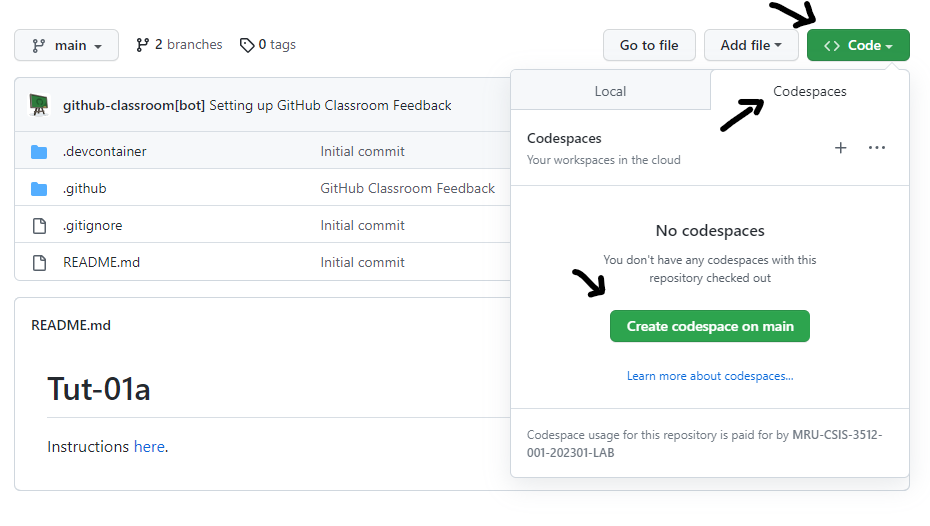
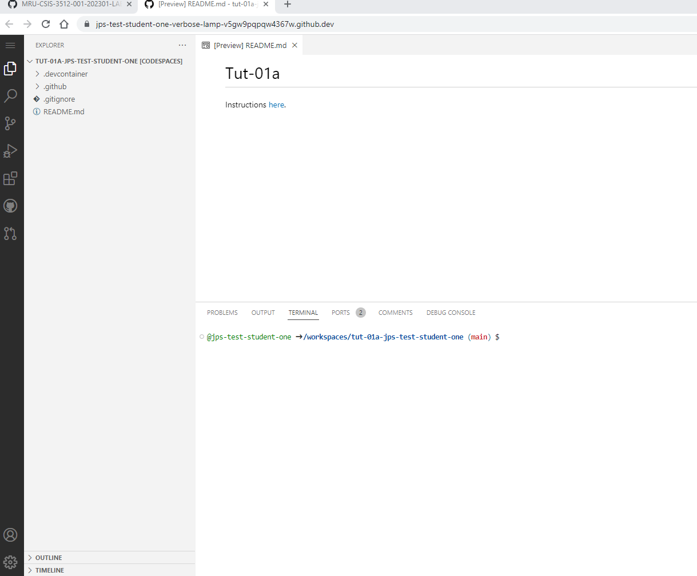
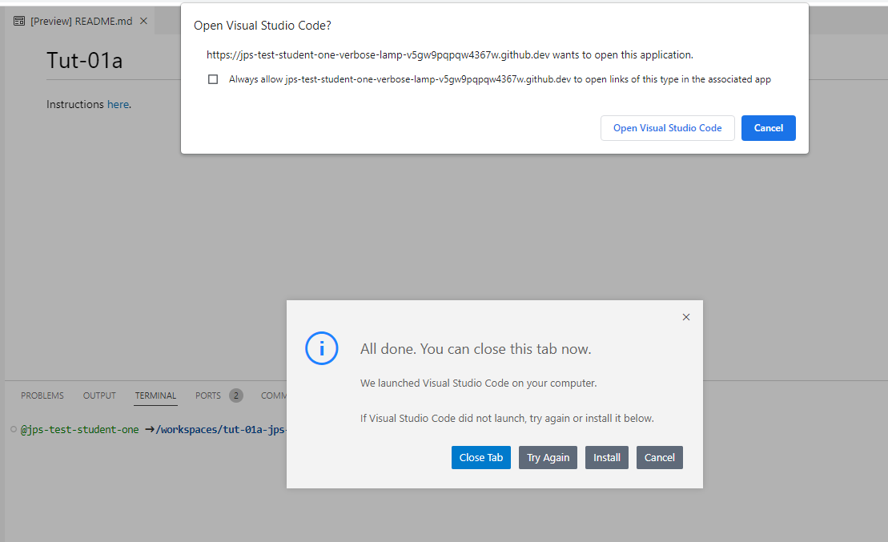
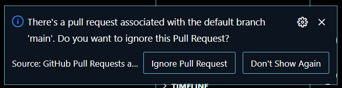
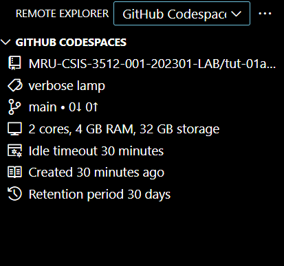
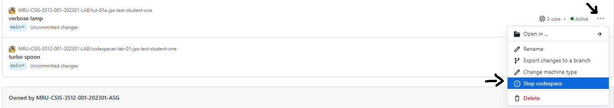
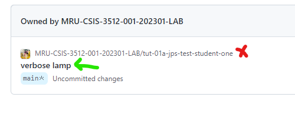
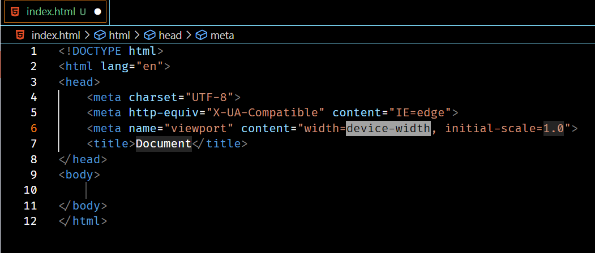
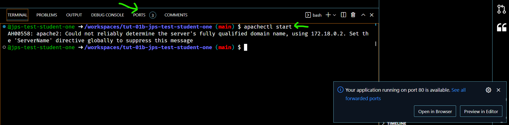
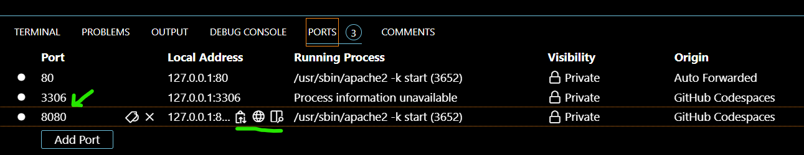

# Tut-01

## Questions To Answer

1. _Who are these people around you?!?_
2. _Why  should I bother coming to tuts if they're not worth marks?_
3. _Where are the instructions for tutorials?_
4. _How do get the starting files for tutorials (and for The Project)?_
5. _What are Codespaces, and why are we using them?_
6. _How do I start up a Codespace so I can get coding - and start it back up again if it ever stops?_
7. _How can I cut down on the time needed to bang out markup?_
8. _How do I look at my work in a browser?_
9. _How do I keep my code all formatted nicely so it is easier to understand?_
10. _What happens if I don't push my work in Codespaces?_

## Background

Every tutorial will see us doing the same sort of things:

1. Grabbing a GitHub Classroom Assignment.
2. Maybe spinning up a Codespace (esp. at the start of the course, where we're dealing with PHP).
3. Doing some educational things.
4. Pushing your finished (or partially) finished work up to GitHub, so you can access it later and/or have JP provide you some feedbak.
5. Re-opening a closed Codespace to continue working on it.

We're going to try to do this process **twice** today, so that you start to feel comfortable with it.

## Do These Things

### Prerequisites

Before you get started, please make sure whatever VS Code installation you are using (personal laptop or lab machine) has the following extensions installed:
- [ ] GitHub Codespaces
- [ ] Dev Containers
- [ ] Markdown All in One
- [ ] Markdown Preview Github Styling
- [ ] PHP Debug
- [ ] PHP Intelephense

_If you plan on working on lab machines a lot, you should look into the [Settings Sync](https://code.visualstudio.com/docs/editor/settings-sync) feature in VS Code. It's very nice._

---

### Tut-01a: Part 1 (Accessing Your First Codespace)

_Things might behave a bit differently for you than what you see here. If they do, don't panic. If you're in the lab while doing this, just flag JP down. If you're not, then just do your best - you're not going to break anything permanently if you poke around a bit!_

1. Accept this GitHub Classroom Assignment: https://classroom.github.com/a/T4pK7w8b

    The first time you accept an assignment from GitHub Classroom, you'll need to link your GitHub account info to your "real" name:
    
    
    
    Just choose your name from the list and continue on.

2. Time to spin up your Codespace! Take a look here:

    

3. Wait a while. Magic takes time, yes?

4. You'll eventually be sitting in a browser tab that looks an **awful** lot like VS Code:

    
    
    _You're actually remoting into a virtual machine running somewhere out there in cloud land. Via your browser. Crazy world we live in, yes?_

5. As cool as using your browser as your IDE is, there are some limitations that we bump into that will be show-stoppers for our PHP development, so we want to open up this Codespace in VS Code. Let's do that.

    1. Go to VS Code's Command Palette (`Ctrl + Shift + P`), search for `Codespaces: Open in VS Code Desktop`, and select it.
 
        _**Aside:** getting comfortable with keyboard shortcuts on any tool you frequently use is time well spent and a sign of competence!_
    
        You should see something like this:
    
        
    
    2. Click that `Open Visual Studio Code` button. If you get a dialog asking you whether it's ok to allow GitHub Codespaces to open a URL, say heck yeah and tell it not to bother you again either.
    
        You might also have VS Code open yet another VS Code window...just roll with it.

    3. If/when you get a warning that looks like the following, you can choose `Ignore Pull Request`: 
    
     
    

#### Take stock for a moment

_So we're jacked in to a remote machine - your own custom-made development machine. Pretty neat!_ 

_If you open up the Command Palette (remember `Ctrl + Shift + P`) and search for `Codespaces: Details`, you can see the details of your box:_

  
  
_Let's finish off by modifying the README.md, pushing our work, and spinning our Codespace down._

6. Open up the `README.md` file and writing one sentence about how all this is making you feel right now. Excited? Confused? Dead inside? You tell me!

7. Add, commit, and push your work. You can use the command line (either inside of VS Code or not), or use VS Code's built-in Git features. 

      _**Aside:** You should be able to use both - having at least some comfort with the command line is going to be important in your career eventually. Honest._

8. Use the Command Palette to `Codespaces: Stop Current Codespace`. You can shut down VS Code - though you're going to need it again shortly when we move to Tut-01b!

9. Go back to your GitHub home page, then go to the `Codespaces` menu (or just go to `github.com/codespaces`). You'll see that although you told VS Code to stop the current Codespace - it's still running! The command seems to be more of a "disconnect VS Code from the Codespace" command. 🙄

  The Codespace will spin down automatically after 30 minutes of activity, but you can also force it to stop by choosing the hotdog menu on the right-hand side and choosing `Stop codespace`:
  
  
  
  Do this now, so you can get a feel for what it's like to re-open a Codespace that has been stopped.
  
---  
  
### Tut-01a: Part 2 (Re-opening a Codespace)

_Codespaces typically aren't going to be one-shot things; you'll want to revisit them occasionally, perhaps even often - like you will be doing for The Project._

1. We want to start up our stopped machine. I _thought_ we could do that easily from within VS Code, but haven't (yet?) found a way to do so easily - but I haven't dug all that deeply tbh. ;)

    You _can_ easily start up a machine from your Codespaces page (https://github.com/codespaces) by clicking on the _machine name_ - not the repo name - of the machine you want to start:
    
    
    
2. Use your experience from Part 1 to get back into VS Code - the "real" application, not the browser one.

3. Add a new file to your machine - call it `frequent-site.md` - and inside of that, put a link to a (SFW) website you often go to and that you're willing to share with me.

4. Add, commit, and push your work.

5. Shut down your machine as you did in Part 1 and confirm that your new file is visible in the repo.

---

### Tut-01b

_That might have been a bit exhausting, but you get used to it after a while. You might also find a better way to do it, so if you do, please tell me so that I can look awesome as well!_

Let's do this again - but THIS time, let's spin up a web server inside the Codespace, make a simple webpage on the Codespace machine...and then view that webpage! 

1. Accept this GitHub Classroom Assignment: https://classroom.github.com/a/RS3GZw_Q.

    _**Aside:** So yes - you can have multiple Codespaces! There is some limit per organization (I think it's two), so eventually you will need to delete Codespaces...**but that doesn't mean you are deleting your source code in your repository - you're just getting rid of the virtual machine that was being used as a development box.**_
    
2. Get into "real" VS Code, connected to your new Codespace.

5. Let's make a simple web page to display, using the power of [Emmet](https://code.visualstudio.com/docs/editor/emmet). Make a new file called `index.html`, open it up in the editor, enter `!`, and hit the Tab key. Magic happens:

    
    
6. Change the title of the page to something that amuses you; add some content to the `<body>` as well. Save the page. 

_Now we want to use our Codespace as a web server - we want to browse to this magical virtual machine and take a look at our new web page._

_The Codespace you've been given has been preconfigured to have an Apache webserver (we'll talk about what that means next week), PHP, and a MariaDB server on it. To use the web server, we need to chant a magic incantation to make it come to life._ 

7. Open up a terminal in VS Code and issue the command `apache2ctl start`.

    
  
5. Close the window saying port 80 is available (just x it).

6. Click on the `8080`, and you'll see some useful icons appear:

    
    
7. Click on the globe icon...and gasp in amazement as your work is displayed. Don't pass out, because your instructor has **zero** first aid skills.

8. Play a bit more if you want.

9. Add, commit, and push your work. Disconnect VS Code from your Codespace and then shut it down if you want. (Or let it time out.)

