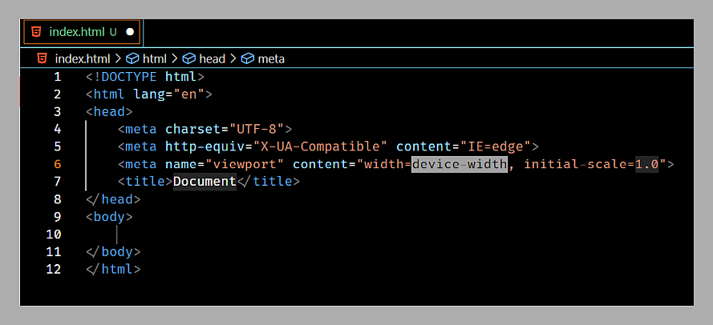
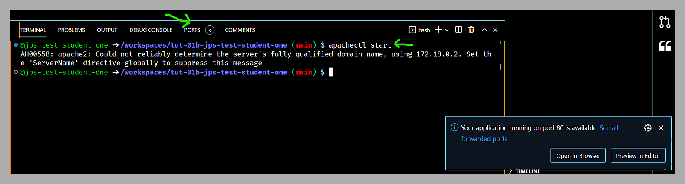
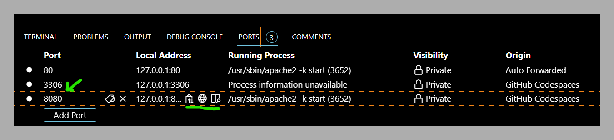

# Tut-01

## Questions To Answer

1. _Who are these people around you?!?_
2. _Why  should I bother coming to tuts if they're not worth marks?_
3. _Where are the instructions for tutorials?_
4. _How do I get the starting files for tutorials (and for The Project)?_
5. _What are Codespaces, and why are we using them?_
6. _How do I start up a Codespace so I can get coding - and start it back up again if it ever stops?_
7. _How can I cut down on the time needed to bang out markup?_
8. _How do I look at my work in a browser?_
9. _How do I keep my code all formatted nicely so it is easier to understand?_
10. _What happens if I don't push my work in Codespaces?_

## Background

Every tutorial will see us doing the same sort of things:

1. Grabbing a GitHub Classroom Assignment.
2. Maybe spinning up a Codespace (esp. at the start of the course, where we're dealing with PHP).
3. Doing some educational things.
4. Pushing your finished (or partially) finished work up to GitHub, so you can access it later and/or have JP provide you some feedbak.
5. Re-opening a closed Codespace to continue working on it.

We're going to try to do this process **twice** today, so that you start to feel comfortable with it.

## Do These Things

### Prerequisites

Before you get started, please make sure whatever VS Code installation you are using (personal laptop or lab machine) has the following extensions installed:
- [ ] GitHub Codespaces
- [ ] Dev Containers
- [ ] Markdown All in One
- [ ] Markdown Preview Github Styling
- [ ] PHP Debug
- [ ] PHP Intelephense

_If you plan on working on lab machines a lot, you should look into the [Settings Sync](https://code.visualstudio.com/docs/editor/settings-sync) feature in VS Code. It's very nice._

### Watch the Screencast

I've made this screencast to walk you through the basic process of connecting and re-connecting to a Codespace: 

[tut-01 walkthrough: connecting/re-connecting to Codespaces](https://watch.screencastify.com/v/TKTZOUnihXd7bwOHVdnN) **[33:48]**

---

### Tut-01a: Part 1 (Accessing Your First Codespace)

1. Accept this GitHub Classroom Assignment: https://classroom.github.com/a/T4pK7w8b

2. Start your Codespace and connect to it, as shown in the screencast.

3. Open up the `README.md` file and writing one sentence about how all this is making you feel right now. Excited? Confused? Dead inside? You tell me!

4. Add, commit, and push your work. You can use the command line (either inside of VS Code or not), or use VS Code's built-in Git features. Both ways are shown in the screencast around the **21:27** mark.)

      _**Aside:** You should be able to use both - having at least some comfort with the command line is going to be important in your career eventually. Honest._

    Go to your repo on GitHub and confirm your work is there.

5. We want to practice re-connecting to a Codespace, so disconnect from your Codespace stop your Codespace now (as shown around the 25:45 mark in the screencast) and then move on to Part 2.
  
---  
  
### Tut-01a: Part 2 (Re-opening a Codespace)

_Codespaces typically aren't going to be one-shot things; you'll want to revisit them occasionally, perhaps even often - like you will be doing for The Project._

1. Start up your Codespace using either of the methods shown in the screencast (around the 28:38 mark).

2. Add a new file to your machine - call it `frequent-site.md` - and inside of that, put a link to a (SFW) website you often go to and that you're willing to share with me.

3. Add, commit, and push your work.

4. Shut down your machine as you did in Part 1 and confirm that your new file is visible in the repo.

---

### Tut-01b: Running a Web Server on Your Codespaces

_That might have been a bit exhausting, but you get used to it after a while. You might also find a better way to do it, so if you do, please tell me so that I can look awesome as well!_

Let's do this again - but THIS time, let's spin up a web server inside the Codespace, make a simple webpage on the Codespace machine...and then view that webpage! 

1. Accept this GitHub Classroom Assignment: https://classroom.github.com/a/RS3GZw_Q.

    _**Aside:** So yes - you can have multiple Codespaces! There is some limit per organization (I think it's two), so eventually you will need to delete Codespaces...**so remember to push your work before deleting that box!**_
    
1. Get into "real" VS Code, connected to your new Codespace.

1. Let's make a simple web page to display, using the power of [Emmet](https://code.visualstudio.com/docs/editor/emmet). Make a new file called `index.html`, open it up in the editor, enter `!`, and hit the Tab key. Magic happens:

    |          |
    |:---------------------------------------------------------:|
    | _Emmet makes writing markup slightly less soul-crushing._ |
    
1. Change the title of the page to something that amuses you; add some content to the `<body>` as well. Save the page. 

> **a short detour into formatting**

> _Take a moment to set up VS Code so that it formats your HTML nicely everytime you save. See if you can figure out how to do this on your own - but I'll give you a hint: take a look under `File > Preferences > Settings` and search for the `default formatter` settings and `format on save` settings that seem appropriate._
> 
> _Snag JP if you're stuck._

#### the final push: getting the web server running & looking at your work

_Now we want to use our Codespace as a web server - we want to browse to this magical virtual machine and take a look at our new web page._

_The Codespace you've been given has been preconfigured to have an Apache webserver (we'll talk about what that means next week), PHP, and a MariaDB server on it. To use the web server, we need to chant a magic incantation to make it come to life._ 

1. Open up a terminal in VS Code and issue the command `apache2ctl start`.

    |                             |
    |:----------------------------------------------------------------------------:|
    | _Starting up the Apache web server so you can browse web pages living there._ |
  
1. Close the window saying port 80 is available (just x it).

1. Click on the `8080`, and you'll see some useful icons appear:

    |              |
    |:-----------------------------------------------:|
    | _The ports available after starting up Apache._ |
    
7. Click on the globe icon...and gasp in amazement as your work is displayed. Don't pass out, because your instructor has **zero** first aid skills.

1. Play a bit more if you want.

1. Add, commit, and push your work. Confirm that it's in your GitHub repo. 

1. Disconnect VS Code from your Codespace and then shut it down if you want. (Or let it time out.)

