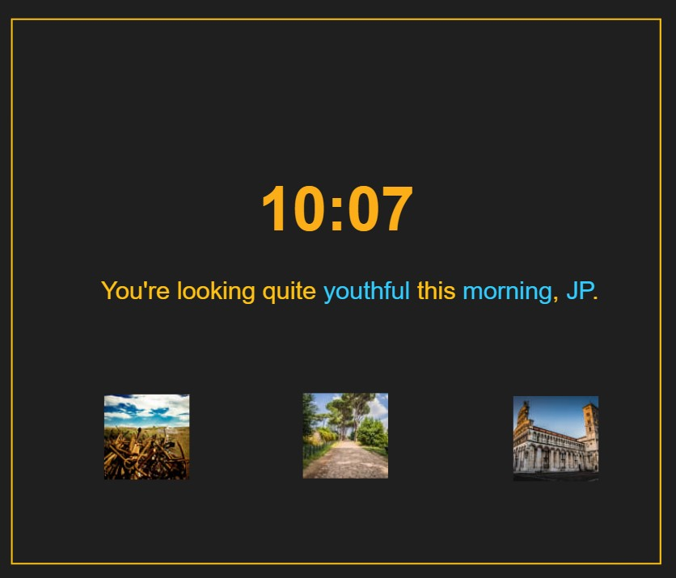

# Tut-02

## Links You'll Need

| What                  | Where                                   |
| --------------------- | --------------------------------------- |
| Tut-02 Screencast     | https://youtu.be/MDFihdo2HGw            |
| GH Classroom Asg      | https://classroom.github.com/a/QVKjvr_u |
| Random Word Generator | https://random-word-form.herokuapp.com  |
| Lorem Picsum          | https://picsum.photos                   |

## Background

This tutorial will help you practice some basic PHP language skills, like working with variables, arrays, and functions.

You'll also be crafting some image tags that tie into Cloudinary. There will be a lot of those in The Project.

## Questions To Answer

1. _Can you create a really lame Moomentum clone in PHP?_
2. _Can you use an API to snag some random adjectives?_
3. _Do you remember enough CSS to evenly distribute 3 pictures on a page?_
4. _Can you create some simple PHP functions that..._
   1. _...return the time of day (morning, afternoon, evening) based on the actual time?_
   2. _...return a random word from an array of words?_
5. _Can you find a way to display the current time, in **our** time zone?_
6. _Can you create a basic transformation in Cloudinary that allows you to load images from your Cloudinary media library that are smallish?_

## Do This

Your goal is to build something like this:

### Details

- [ ] The time shown should be in 12-hour clock time, for _our_ time zone.
- [ ] The words in blue should be generated by PHP.
  - [ ] The adjective should be generated by a function that selects a random adjective from an array of 10 adjectives you snag from the Random Word Generator.
  - [ ] The morning(afternoon/evening) should be generated by a function that determines the right string based on the current time in our time zone.
  - [ ] The name can just be a variable that has a hardcoded value.
- [ ] The pictures should come from The Project photos that you've placed on Cloudinary. The images displayed should...
  - [ ] ...be smallish.
  - [ ] ...be lined up and spaced nicely.
  - [ ] ...should, ideally, have `src` attributes generated from a function that takes in a photo ID and returns a Cloudinary URL.

## Submission

If you remember to push your work back to GitHub, I'll have a look at it on Friday/Saturday/Sunday and provide some feedback. If you don't push in that time, no feedback will be provided!

