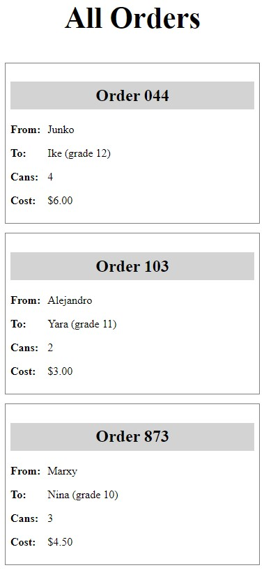
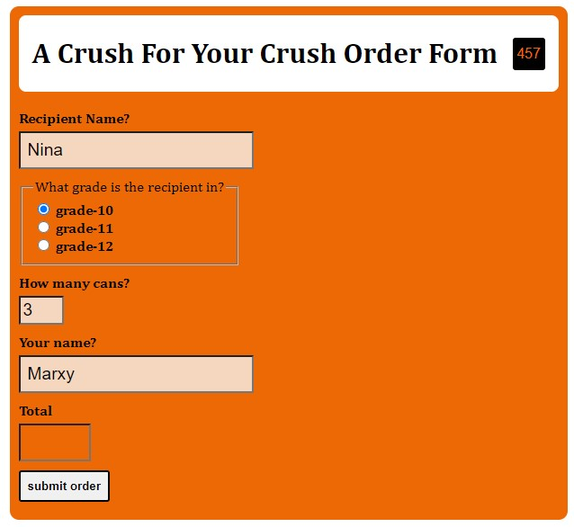
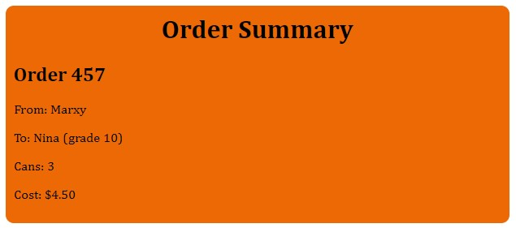
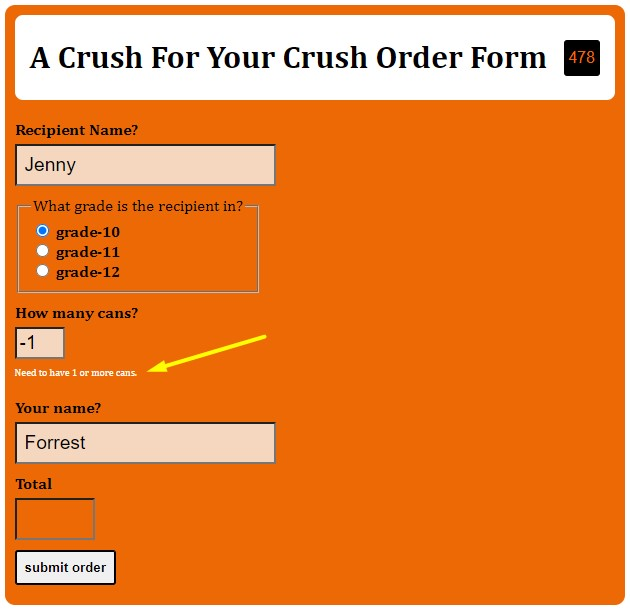

# Tut-03

## Links You'll Need

| What              | Where |
| ----------------- | ----- |
| Tut-03 Screencast | xx    |
| GH Classroom Asg  | xx    |

## Background

Let's suppose you're doing some pro bono work for a niece or nephew who's in high school. They're doing this funky activity where you can buy a can (or multiple cans) of Orange Crush for someone you have a crush on. Because that's something teenagers do, obviously.

## Things You'll Be Doing

This tutorial has you work on two things.

One thing will be to [display a list of hardcoded orders](#do-this-display-all-orders) in a specific format. This will give you some practice working with `foreach` and associative arrays, which is always pleasant.

Another thing will be to [process an order form](#do-this-process-an-order-form). You'll be validating submissions of the form with PHP, displaying a summary of the form if it's filled out correctly, and re-displaying the form with error messages if there are problems.

You can complete these activities in any order, but I put the list display first because I think it's easier.

## Questions To Answer

1. _Can you create a really lame Moomentum clone in PHP?_
2. _Can you use an API to snag some random adjectives?_
3. _Do you remember enough CSS to evenly distribute 3 pictures on a page?_
4. _Can you create some simple PHP functions that..._
   1. _...return the time of day (morning, afternoon, evening) based on the actual time?_
   2. _...return a random word from an array of words?_
5. _Can you find a way to display the current time, in **our** time zone?_
6. _Can you create a basic transformation in Cloudinary that allows you to load images from your Cloudinary media library that are smallish?_

---
## Do This: Display All Orders

### Overview w/ Examples

We want to make page where you can see a list of all the Crush orders currently pending. 

> *This would be pretty useful, because somebody whose job it is to collect money, or distribute  Crushes, could go to that page and get the info they needed to do their jobs.*

Here is what a person going to `all-orders.php` should see:

|             |
| :------------------------------------------: |
| _Your goal. Feel free to tweak the styling._ |

The order info would normally come from a database query, but since we haven't quite gotten there yet, I've just provided you with some hardcoded data that you'll use instead. 

> _Consider doing the same sort of thing - hardcoding data - for your work in The Project. It'll allow you to flesh out your pages - which you have the skills to do right now - and gain some important momentum!_

### File Details

#### `all-orders.php`. 

This file's job is to gather together the data to display. Note how this file is not doing any displaying itself - it's leaving that to `all-orders.view.php`, which it's `require`ing at the bottom.


#### `all-orders.view.php`. 

This file's job is to generate the page's HTML and CSS, plugging in data where necessary. There's not a lot here now, except some `requires` to generate the start and end of the HTML document. 


These don't necessarily have to be completed in this order.

- [ ] Add code to `all-orders.view.php` so that it displays the `$orders` as shown in the screenshot above.

    In the comments, you'll see where you'll have to add your code. If you make your code generate markup like the following for each order, the CSS I've given will "just work":

    ```html
    <div class=order>
        <h2>Order 044</h2>
        <p><span class="label">From:</span> Junko</p>
        <p><span class="label">To:</span> Ike (grade 12)</p>
        <p><span class="label">Cans:</span> 4</p>
        <p><span class="label">Cost:</span> $6.00</p>
    </div>
    ```

- [ ] `$orders` is not currently sorted. Sort `$orders` so that it displays as shown in the screenshot above.

    _**Hint:** The order numbers are **keys** of the `$orders` associative array. That might help you in your Googling._

- [ ] Provide at least _some_ additional styling to your page - take this opportunity to practice your CSS at least a bit here, even if it just means changing some colors or fonts or whatever.

__


## Do This: Process an Order Form

### Overview w/ Examples

When the user arrives on `order-form.php`, they'll see...a form. 

If they fill it out and submit it correctly, it should go to a page that summarizes the form result in a certain format.

If they've made errors in their entries, then they will see the form again, with helpful error messages.

For example, if the form is filled out this way:

|                                                                                                                                                                                                                 |
| :------------------------------------------------------------------------------------------------------------------------------------------------------------------------------------------------------------------------------------------: |
| _**Note**: The total is calculated using JavaScript. You'll be learning how to do things like this later in the course! I didn't have time to polish its behaviour, so it's a bit janky and I feel suitably mortified, thank you very much._ |

Then when the form is submitted, the following should be seen:



If, however, they fill in the form incorrectly - are missing the recipient name or have an invalid number of cans - then the form is re-displayed, with all the previous entered data still there and a useful error message displayed:



### File Details

#### `order-form.php`

This is our controller. There are some comments here that will guide you.

#### `views/order-form.view.php`

Take note of the various form elements, as you will need to access them to complete this exercise.

#### `helpers/helpers.php`

You can use this if you want to. Notice how it brings in a constant from another file.

### Your Tasks

- [ ] Create a view (in the `views` folder) to create the markup needed to display the form summary on a successful submit. Call it whatever you want - but remember you'll need to use that view in `order-form.php` for when a successful submission happens.

- [ ] Complete the 

1. Inside your submission handler page, create code that will print out the desired results in the desired format. Make sure you DON'T use the value from the #order-total input for the total cost of the Crushes. Why? Because a user could easily alter that field and wind up paying nothing! Instead, do the calculations necessary in your PHP file instead. **One can is $1.50.**

#### Hints/Suggestions

asdfa

---

## Submission

If you remember to push your work back to GitHub, I'll have a look at it on Friday/Saturday/Sunday and provide some feedback. If you don't push in that time, no feedback will be provided!

