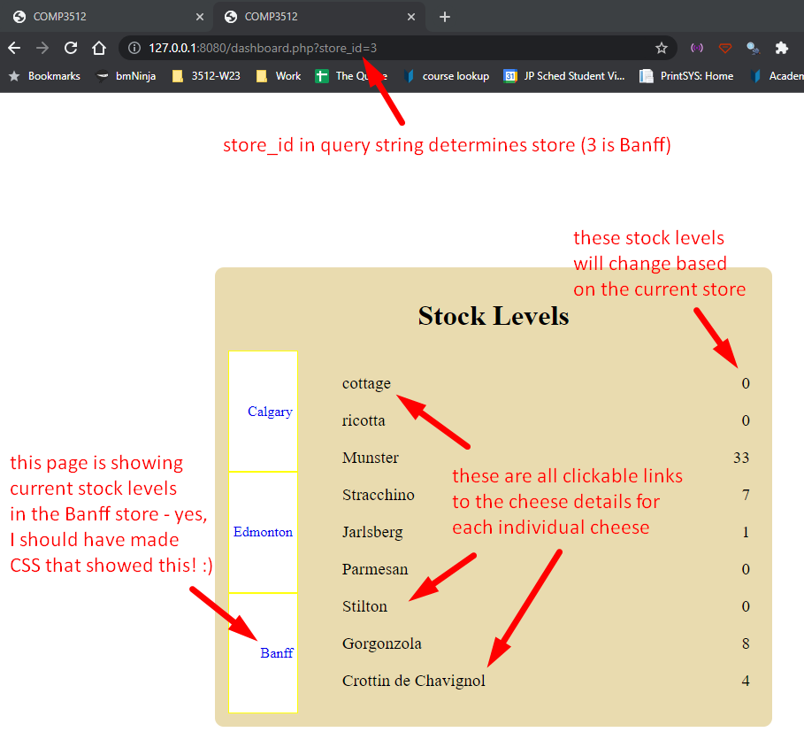
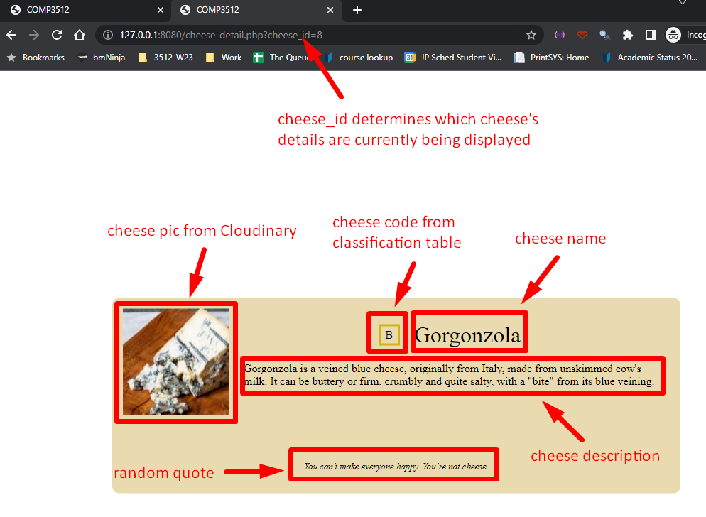

# Tut-05

## Links You'll Need

| What              | Where                                                                              |
| ----------------- | ---------------------------------------------------------------------------------- |
| Tut-05 Screencast | https://youtu.be/rrwTZ1p_VhA                                                                                |
| GH Classroom Asg  | [https://classroom.github.com/a/ArC5Yodn](https://classroom.github.com/a/ArC5Yodn) |

## Background

Congratulations - you've landed a sweet cheese shop gig!

Your new overlords want to have a way to tell at a glance what current cheese inventory levels are at 3 stores (Calgary, Edmonton, and Banff).

They also want to have a page for each type of cheese, with a picture, classification code (F for Fresh, S for Soft, etc), a description of the cheese, and an amusing cheese-related saying because why not?  

You've got the views completed for these 2 pages...you had some hardcoded data to get them into working shape...but now it's time to actually bring in the real data and see how things go.

## Things You'll Be Doing

This tutorial will help you practice examining views to determine what data (and the format of that data) controllers will need to provide to them. This is a fundamental skill - once we've decided what kind of pages we want to create and what data we want to appear on them, the act of gathering that data together is often fairly mechanical and straightforward!

The major focus of this tutorial is doing that mechanical and straightforward work - interacting with a database and collecting the necessary data in the desired format. 

---

## Step 1: create and populate `cheese_db`

We can't interact with a database if there's no database to interact with, so let's get on that.

In the Codespace, you'll find the script `db-creation-script/create-cheese.db.sql`. Use that script to create and populate our `cheese_db` database, and take a few moments to look at the different tables in it and the data they contain.

> _If you are a bit fuzzy on this process, check out the [connecting to a Codespace with DBeaver](https://docs.google.com/document/d/1hivswJpz-tUv5OIOU2nEOtH5S_xbHROVE_PZJ0Tdu54/edit?usp=share_link) and [creating and populating a DB with DBeaver via a script](https://docs.google.com/document/d/1QayecBekIQ-6iL2eUZMX9i0iQ5huOS6bFCKomzMQmjk/edit?usp=share_link) docs._ 

## Step 2: do some detective work on the project's files

Take a quick look through the various folders and files available in the project. In particular, pay attention to the files in the `database` and `helpers` folders. I've documented the helpers, since I'm assuming you are fairly comfortable with what's going on with the `database` files from lecture.

Don't skip this step - some of the helpers are essential for you getting through this tutorial in one piece!

## Step 3: do some detective work on the views

There are 2 views in this project: `views/cheese-detail.view.php` and `views/dashboard.view`. You should look at what data is needed in these views (look for `$`, right? 😉). If you see that some of the data is (or is that are?) associative arrays, then you'll need to figure out what **keys** those arrays need, too.

Keep track of the results of your investigation - you're about to use those results in the next step.

## Step 4: generate the needed data in the controllers

_I've tagged the files and functions you need to work on with `TODO`, so if you do a Search in VS Code (Ctrl + Shift + F) and search for TODO, you'll find them easily._

### `dashboard.php`

The dashboard page is supposed to show inventory levels at the 3 different stores for the various cheeses. Which store is currently selected is controlled by a query string.

> _The visual design of the pages is pretty rough - as you've undoubtedly noticed - and the currently-selected store is not highlighted, though it really should be. Don't worry about it._

Using your work from **Step 3**, add code to the controller so that it gathers the proper data and makes its view (`dashboard.view.php`) happy.

#### feel like an extra challenge? (optional)

If you want to push yourself a bit, alter your work so that if there is an invalid query string (for example, it's not there, or not a valid store id) then the page just shows the results for the Calgary store.

I've placed a helper function in `helpers/query-string-helpers.php` if you want to give that a try.

### `cheese-detail.php`

The cheese detail page is supposed to show detailed information about the cheese chosen via a query string:

Using your work from **Step 3**, add code to the controller so that it gathers the proper data and makes its view (`cheese-detail.view.php`) happy.

#### feel like an extra challenge? (optional)

Again, if you want to try and stretch those wings a bit, add code so that the query string is validated, like it was for the dashboard. You'll have to make your own helper functions this time. You also get to decide what happens if it **is** and invalid query string!

---

## Don't forget to push!

If you remember to push your work back to GitHub, I'll have a look at it on Saturday/Sunday/Monday and provide some feedback. If you don't push in that time, no feedback will be provided - **BUT you can always come and talk to me in person after those days if you want me to look over your work!**
