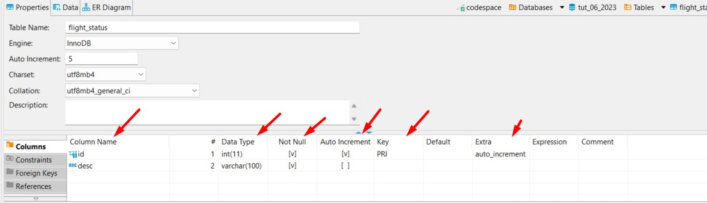
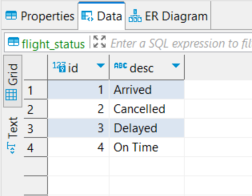

# Tut-06

## Links You'll Need

| What                      | Where   |
| ------------------------- | ------- |
| Tut-05 Screencast [xx:xx] | xx      |
| GH Classroom Asg          | [https://classroom.github.com/a/4TX9ys-s](https://classroom.github.com/a/4TX9ys-s) |

## Background

Back to the airline gig we go.

Your boss has decided that JavaScript is the way to go for the project...but you've already put a lot of work on the server side in PHP and have convinced your boss that it would be useful to use your PHP skills to serve up some API endpoints that could be used when you start doing client-facing pages using JS.

Synergy!

## Things You'll Be Doing

This tutorial has you creating some API endpoints in PHP; the idea is that you have stuff in a database you want to be able to provide to anyone (or any _code_) that knows the endpoint.

Consuming APIs is pretty darn fun - and something you'll need to do for The Project. _Making_ them, like you're doing here and in The Project, can be surprisingly easy if you do it in a basic way. Which we'll be doing here.

## The End Goal

There are 2 endpoints you'll need to make here: one for `api/airport.php` and one for `api/arrivals.php`. Here are the details - all API endpoints must return a valid JSON response:

### `/api/airport.php?code={airport_code}`

#### Description
Provides the name of the city associated with the given airport code. If there is no such code found, an empty response is returned.

#### Query Parameters
`airport_code` _string_  **Required**

The airport code you want to find the city for.

#### Example Responses

```json
// response to api/airport.php?code=yyc
{
  "code": "YYC",
  "city": "Calgary"
}
```

```json
// response to api/airport.php?code=arglebargleboo
{

}
```

### `/api/arrivals.php?status={status}`

#### Description
Lists the arrivals that have a given status at some airport.

#### Query Parameters
`status` _string_  **optional**

The status of the arrivals you wish to receive. The valid values are "on time", "cancelled", "delayed", and "arrived".

#### Example Response

```json
// response to api/arrivals.php?status=cancelled
{
  "total-count": 2,
  "arrivals": [
    {
      "name": "Sunwing",
      "origin": "Calgary",
      "dest": "Denver",
      "status": "Cancelled"
    },
    {
      "name": "Air Canada",
      "origin": "Edmonton",
      "dest": "Calgary",
      "status": "Cancelled"
    }
  ]
}
```


### `/api/arrivals.php`  (optional, if you'd like a challenge)

#### Description
Provides a list of all known arrivals at some gate; displays an airline name, origin city, destination city, and the current status of the arrival.

Entries are in alphabetic order of status.

#### Query Parameters
none

#### Example Response

```json
{
  "total-count": 7,
  "arrivals": [
    {
      "name": "Air Canada",
      "origin": "Calgary",
      "dest": "Vancouver",
      "status": "Arrived"
    },
    {
      "name": "WestJet",
      "origin": "Edmonton",
      "dest": "Calgary",
      "status": "Arrived"
    },
    {
      "name": "Sunwing",
      "origin": "Calgary",
      "dest": "Denver",
      "status": "Cancelled"
    },
    {
      "name": "Air Canada",
      "origin": "Edmonton",
      "dest": "Calgary",
      "status": "Cancelled"
    },
    {
      "name": "Flair",
      "origin": "Calgary",
      "dest": "Edmonton",
      "status": "Delayed"
    },
    {
      "name": "WestJet",
      "origin": "Vancouver",
      "dest": "Calgary",
      "status": "On Time"
    },
    {
      "name": "WestJet",
      "origin": "Calgary",
      "dest": "Halifax",
      "status": "On Time"
    }
  ]
}
```


---

## Step 1: get some tools in place

When you're calling an API (often called _consuming_ it), it can be useful to have a few tools in place to make the process a bit easier and to provide you with a bit of extra information or features that can be helpful.

Here are some suggestions. None of them are mandatory, but I'd at least pick one and roll with it for this tutorial. Put the others on your radar and play with them later - like during The Project - if you don't like your first choice.

### options

1. Go to the API endpoint in your browser and use a browser extension to make it look all purdy-like. 

    I currently like [JSON viewer](https://chrome.google.com/webstore/detail/json-viewer/gbmdgpbipfallnflgajpaliibnhdgobh). Simple. Nice formatting. Yup.
    
2. Add an extension to VS Code and look at your endpoints inside your editor. Keep it in the family.

    I've added [Thunder Client](https://marketplace.visualstudio.com/items?itemName=rangav.vscode-thunder-client) to this Codespace because it had a monstrous number of downloads and stars. And an awesome name.
    
3. Use an online tool. More features and available right in the browser, which is nice.

    Although Postman is an "industry standard" kind of thing, it's turned into a bit of a beast. Instead of Mr. Burly, I've got a soft spot for [Hoppscotch.io](https://hoppscotch.io/). You'll need to add the [Hoppscotch Browser Extension](https://chrome.google.com/webstore/detail/hoppscotch-browser-extens/amknoiejhlmhancpahfcfcfhllgkpbld?hl=en) to make things work smoothly.

---

## Step 2: create and partially populate the tutorial's  database

Since we're serving up an API endpoint, we need some data to actually serve up!

Use `db-creation-script/create-tut-06-db.sql` to create and (partially) populate the database for this tutorial. Afterward, take a few moments to see what the tables are and what's in 'em.

## Step 3: add some data to the database

You might have been wondering why I used "partially" a couple of times in step 2. It's because you need to create and populate one of the tables yourself.

You'll need to create a table called `flight_status` using DBeaver. 

It needs two fields:

1. an id
2. a description

Here's what the beastie looks like in the completed version in my DBeaver:



_Notice the column names, data types, and other things arrowed in the pic above. You might need to look up some documentation...though it's surprisingly easy to muddle through just clicking and right-clicking things in DBeaver!_

After you've got the table set up, populate it with this data:



## Step 4: create your API endpoints

The final step is to create the API endpoints described upstairs in [The End Goal](#the-end-goal). You'll need to add code to `api/airport.php` and `api/arrivals.php`.

The flow of each of these files follows the same pattern:

1. do any necessary `require`s
2. grab any necessary query string items
3. run a database query
4. build the response needed using the results of the query
5. set the header to the correct content type
6. echo the result of calling `json_encode()` on the built response


### some hints & suggestions

- Build and test your queries out in DBeaver first. In particular, the query you need for your `arrivals` endpoint is a bit long, so you definitely don't want to jump right into the PHP code.
- Feel free to add some helpers to `query-helpers.php` to keep things cleanish.
- For the `airport` endpoint, remember that we want to return `{ }` if the provided code was not found; look at the docs for `json_encode()` to see how to do this easily - search for `JSON_FORCE_OBJECT`...
- If you're trying to do the optional endpoint, you can make your life much easier by using `LIKE` and a wildcard in the query...but there's a small catch. Take a look [at this helpful blurb](https://phpdelusions.net/pdo#like) from phpdelusions. 

---

## Don't forget to push!

If you remember to push your work back to GitHub, I'll have a look at it on Saturday/Sunday/Monday and provide some feedback. If you don't push in that time, no feedback will be provided - **BUT you can always come and talk to me in person after those days if you want me to look over your work!**
