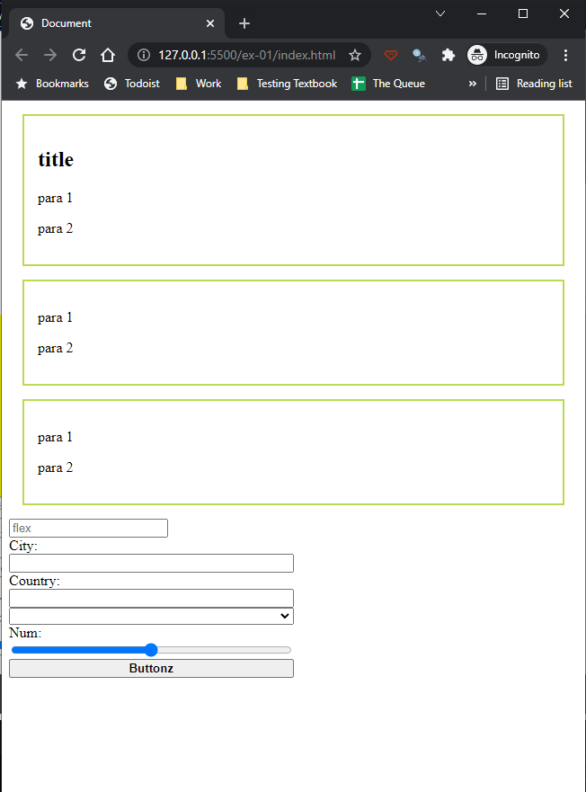
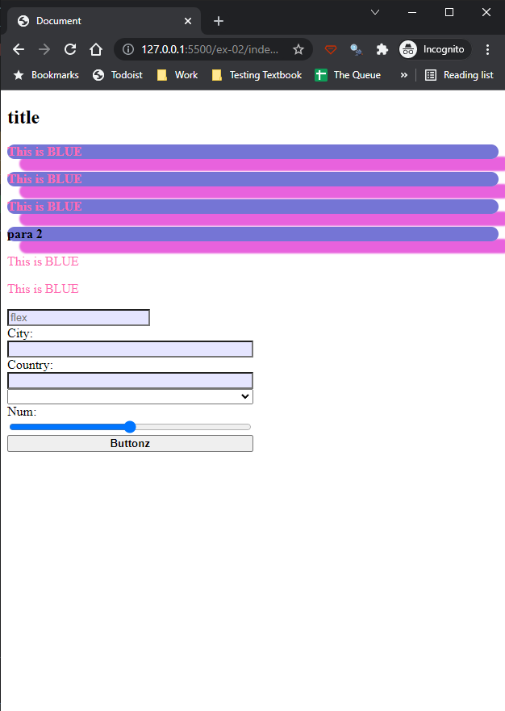
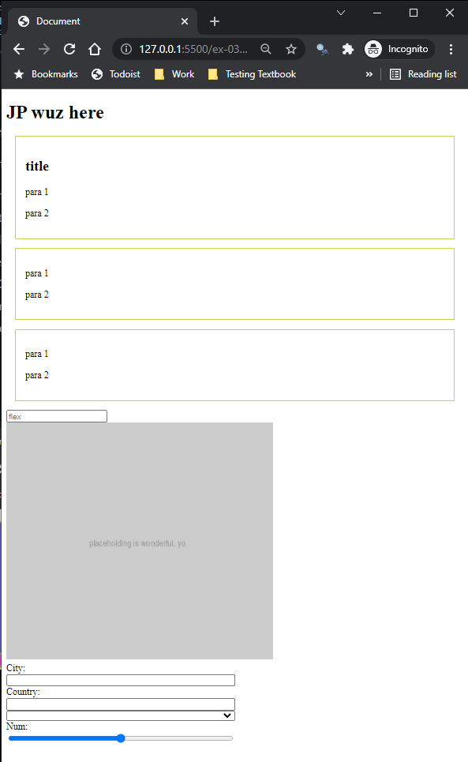

# Tut-09

## Links You'll Need

| What              | Where                                                                              |
| ----------------- | ---------------------------------------------------------------------------------- |
| Tut-09 Screencast | https://youtu.be/EOK1GeOfPwc                                                       |
| GH Classroom Asg  | [https://classroom.github.com/a/OQzD5jzS](https://classroom.github.com/a/OQzD5jzS) |

## Things You'll Be Doing

This tutorial is meant to get you used to futzing with the DOM: selecting things, altering text, playing with styles, adding elements, and removing them. Roll up your sleeves and gird your loins, not necessarily in that order. 

---

## How Things Look at the Start of Each Exercise

The same page, `index.html` is used for each exercise. It looks like this in the browser:

Your job for each exercise will be to **change how the page looks using only JavaScript - you're not allowed to touch the html or its external style sheet at all**. 

Fun!

---

## IMPORTANT

Don't forget your `<script>` tags to bring in your JS files - and do so as modules!

## ex-01

### prerequisites

To complete this exercise, you should know how to:

- [ ] select a DOM element
- [ ] change the text associated with an element
- [ ] apply inline styles to elements
- [ ] add a CSS class to an element
- [ ] add an attribute to an element

### goal

When you're done the steps below, `ex-01/index.html` should look like this:

### what you'll need to do in `ex-01/index.js`

1. Change the text of the `<h2>` to say "This title is bland"
   
2. Change the element with id `specialPara` to have text that is `2em` and `bold`.
   
3. Change the background color of the second `<article>` to `yellow`.

    > _Try and use a CSS selector here instead of resorting to array notation._
   
4. Change the placeholder in the text input with name `hex` to `#000`.
   
5. Add the `boxy` class to the first div that has the class `box`. Make sure you don't remove the `box` class during this process - you're not REPLACING the `box` class!

---

## ex-02

### prerequisites

To complete this exercise, you should know how to:

- [ ] select multiple DOM elements
- [ ] change the text associated with an element
- [ ] apply inline styles to elements
- [ ] apply and remove CSS classes from an element

### goal

When you're done the steps below, `ex-02/index.html` should look like this:

 

### what you'll need to do in `ex-02/index.js`

1. Change the text color of all `
` tags that are DIRECT children of `box` class elements to `hotpink`. Also change these same elements' text to say "This is BLUE" (which is a lie, but amusing).

    > _You **will** need to loop here._

2. Remove the `box` class from everything that has it.
   
3. Add the `strong` and `boxy` classes to every `
` within the first `<article>`. You might want to refresh your memory regarding the `first-of-type` pseudo-class....
   
   > _**Tip:** `classList.add()` can take in multiple classes, separated by commas!_
   
4. Change the `background colour` of every `text input` to be `rgba(0,0,255,0.1)`
   
---

## ex-03

### prerequisites

To complete this exercise, you should know how to:

- [ ] select one or more DOM elements
- [ ] change the text associated with an element
- [ ] build DOM elements with desired attributes
- [ ] add elements to desired locations in the DOM
- [ ] remove elements from the DOM

### goal

When you're done the steps below, `ex-03/index.html` should look like this:

### what you'll need to do in `ex-03/index.js`

1. Remove the `<button>`.
  
2. Add an `` inside the `div#container` tag. The img tag shows the source `https://via.placeholder.com/400x400?text=placeholding+is+wonderful,+yo` and the alt text `"Placehold *this*!"`

    _The size of the image shown in the instructions might be slightly different...I don't have time to go back and fix it, unfortunately!_

3. Add a `<header>` tag with an `<h1>` child that contains the text `(your name) wuz here` as the **first** child of the `<body>`. 

---

## Don't forget to push!

If you remember to push your work back to GitHub, I'll have a look at it on Saturday/Sunday/Monday and provide some feedback. If you don't push in that time, no feedback will be provided - **BUT you can always come and talk to me in person after those days if you want me to look over your work!**

