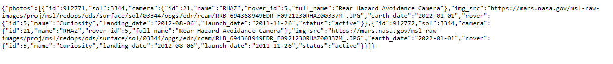

# Tut-11: Fetch, Rover

## Links You'll Need

| What              | Where        |
| ----------------- | ------------ |
| Tut-11 Screencast | Negative     |
| GH Classroom Asg  | Coming Later |

## Things You'll Be Doing

This tutorial will give you some more practice using `fetch` and experience the joys of asynchronous coding through the use of JS's `async/await` feature. We're going to be grabbing [Mars Curiosity rover](https://en.wikipedia.org/wiki/Curiosity_(rover)) images. That sucker landed up there in 2012...and is still operational, doodling around and checking stuff out. That's pretty neat.

---

## The Final Product

The goal of this tutorial is to make a little application that shows the photos available from Curiosity from a given camera (it has multiple ones) on a given date. 

Here's a quick (like 17 seconds quick) screencast showing the finished product in action. There's no sound. 

https://youtu.be/QdWXJy78vZY

_Note that when no pics are available, that fact is displayed to the user._


We'll break this biggish task up into chunks of manageable exercises. 


## Getting Your Bearings  

You should take a look at the `index.html` file. Notice how near the bottom there are a pair of divs (`#photos` and `#spinny`), that hold any photos pulled in from the API and the loading animation, respectively. They both start off with a CSS class of "hidden". You should take a quick look in `style.css` to see what that class does.

You should also examine those radio buttons. The `value` attributes they have will be useful to you later....

--- 

## ex-00: grab an API key

You're going to need an API key for this. Fortunately, NASA is plain awesome and the process is free and gobsmackingly simple.

1. Go to https://api.nasa.gov.
2. Generate a key.
3. Write it down somewhere.
4. Say to yourself, "That's it?!?".

---

## ex-01: create an Endpoint constructor function

### prerequisites

To complete this exercise, you should know how to:

- [ ] create a constructor function that creates objects with methods
- [ ] read a simple API doc

### goal

We're going to be querying the Mars Rover Photos API from https://api.nasa.gov. In order to ask the API for photos from the Curiosity rover on a certain date from a certain camera, we need a very specific endpoint format. 

> _Be careful - you want to use the API calls that use an earth date format, not sols. And you want to use an endpoint format that allows for specifying the camera as well. You should be able to piece things together using the various example queries shown in the docs._

Our goal is to create an Endpoint constructor function that allows us to create Endpoint objects that are tied to our API key (from [ex-00](#ex-00-grab-an-api-key)) and that we can ask for endpoints from certain dates/cameras.

If your constructor function is working properly, you should be able to do something like this in the console:

```js
const endpoint = new Endpoint();
endpoint.for({date: '2022-01-23', camera: 'rhaz'})
// returns the URL that would provide photos 
// from the Curiosity rover for 2022-01-23 
// from the Rear Hazard Avoidance Camera
```


### what you'll need to do

1. Look at the [docs for the Mars Rover Photos API](https://api.nasa.gov/#mars-rover-photos). In particular, see if you can figure out what an endpoint that needs to pull information for the Curiosity rover on a particular Earth date from a particular camera would look like.

2. Create a function called `Endpoint` in a new file called `endpoint.js`.

    _Notice the capital 'E' in the function name - we wanna build our convention-following muscles here._

3. Store off our API key in our constructor function. A constant seems reasonable for this. Or you could put that constant in a `constants.js` file and import it from there. You choose.

4. Create a method in our constructor function called `for` that takes in an object with the properties hinted at in the example shown in our goal and returns a valid endpoint URL.

    _Using objects with needed properties as parameters frequently comes in handy._

5. Remember to import `Endpoint` into `index.js`!

6. Test out your function by calling it in `index.js` with different dates and cameras. You should get URLs that you can open up in a browser to observe the resulting JSON. Here's what I see when I go to the URL generated in the example code shown in the goal (sorry it's so freakin' small!):

     

---

## ex-02: create functions to show and hide the loading animation

### prerequisites

To complete this exercise, you should know how to:

- [ ] add and remove CSS classes from a DOM element

### goal

Our goal is to create two functions:

1. `showLoadingAnimation`, which hides `#photos` and unhides `#spinny`.
2. `hideLoadingAnimation`, which hides `#spinny` and unhides `#photos`.

These functions should add/remove the necessary CSS class to reach the goal, so don't forget to take a peek in the `style.css` file in the project.

When your goal is complete, you should be able to head to the console and see your functions work - but since we're using modules, if you want to test from the console, you'l need to add these functions to the window object like this: 

```js
// this is just a TEMPORARY HACK - you should
// remove this code once you're happy the
// functions are working correctly!

window.showLoadingAnimation = showLoadingAnimation;
window.hideLoadingAnimation = hideLoadingAnimation;
```

Here's what I see when I use my functions from the console:

https://youtu.be/ZChlI-rL9qc


### what you'll need to do in `index.js` 

1. Create `showLoadingAnimation` and `hideLoadingAnimation` so they work as expected.

> _If you want to place these functions in a separate file from index.js, that'd be useful practice. You could also organize your JS files into a js folder as well._

---

## ex-03: create a function to find the currently selected camera

### prerequisites

To complete this exercise, you should know how to:

- select a DOM elements matching a given CSS selector
- find the value from a radio button
- ask a radio button DOM element whether it is checked or not

### goal

When we click on the `Display Photos` button, one of the important pieces of information we need is the name of the camera currently selected. This information is stored in the value of the currently checked radio button - but how do we get it?

Our goal here is to make a function called `selectedCamera` that returns the value of the currently selected camera radio button.

If your function is working properly, you should be able to do something like this in the console:

```js
// assume the Front Hazard Avoidance radio button is checked
selectedCamera(); // returns `fhaz`

// assume we now click on the Navigation radio button
selectedCamera(); // now returns `navcam`
```

### what you'll need to do in `index.js` 

1. Create `selectedCamera` so it works as expected.

> _As with ex-02, if you want to place this function in a separate file and/or folder for practice, go for it!_

#### Hints

- There are quite a few ways to do this. Three suggestions, from "meh" to "ya!", IMO:
  1. Select all the radio buttons, loop through them until you find the one that's been checked, and return that checked one's value.
  2. Start off selecting all radio buttons the same as (1), but then turn the NodeList into an Array with the `Array.from` method, and then use `find` to find the checked one (and return its value).
  3. The easiest way? Use the proper CSS selector to grab the checked one and return its value!

---

## ex-03a: create a function to find the selected photo date (optional)

Using the technique from ex-03, you could also create another helper function that returns the photo date in the desired format. 

Your call. But doing this gives an expressive name to a blob of logic and this is one of the most powerful tools in a coder's arsenal....

---

## ex-04: put the pieces together!

### prerequisites

To complete this exercise, you should know how to:

- register an event handler 
- use fetch to get JSON from an API endpoint
- use async/await to use the JSON data and display the necessary photo(s)

### goal

Our goal is to get the app behaving as shown in [the video shown in the final produce section](https://youtu.be/QdWXJy78vZY) section above. 

### what you'll need to do in `index.js` 

1. Create an event handler for the button being clicked. You could start it off by just writing something to the console - that way, you can easily test that you've got the handler hooked up correctly.

2. Flesh out the handler. What does it need to do? The helpers you made in ex 01 thru 03 are definitely going to come in handy here! Ideally, you'll also handle the situation where there are **no images** on a given day and/or for a given camera.

#### Hints

- Since you're using `fetch`, you'll need an endpoint for the currently selected date and camera. How will you create that endpoint? How will you get the currently selected date? Currently selected camera?
- When you do a `resp.json()` on the fetch results, what does the resulting object look like? **Look at it in the conosle!** Which property from that object do you need?
- You'll need to turn the photo objects from the API into `` DOM elements. You've done this kind of thing before....
- How are you going to handle the loading animation show/hide? You've got helpers to do this...but when are you going to call them?
- Don't keep appending images to `#photos` - you'll need to clear it out each time the button is pressed; otherwise, new photos will be added to the end of the ones currently there!

---

## Don't forget to push!

If you remember to push your work back to GitHub, I'll have a look at it on Saturday/Sunday/Monday and provide some feedback. If you don't push in that time, no feedback will be provided - **BUT you can always come and talk to me in person after those days if you want me to look over your work!**